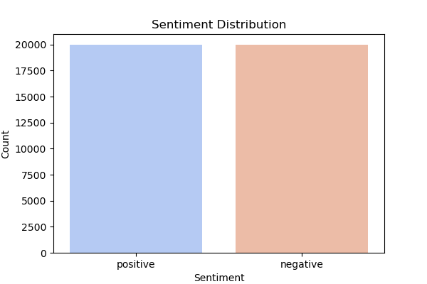
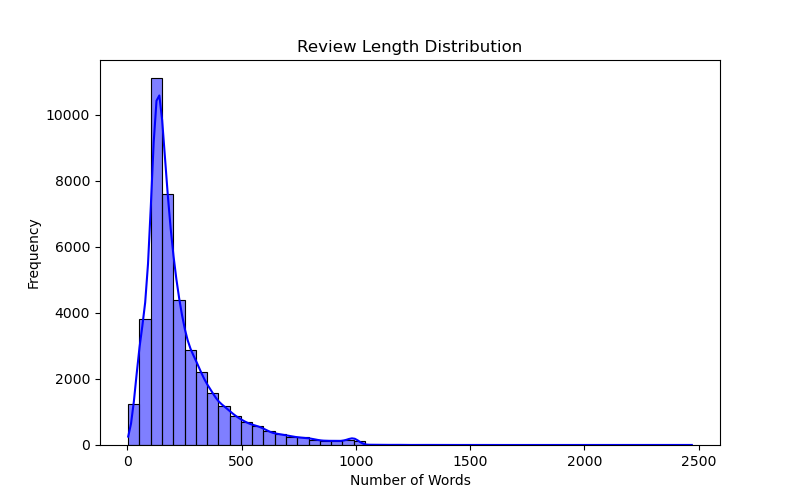

# Sentiment Analysis Project
A study by Serhet Gökdemir, under Data Science Traineeship Program by Epam SYSTEMS.
[Visit My Portfolio](https://serhetgokdemir.github.io)<br><br>

## General Description
The main goal is to demonstrate the ability to solve a sentiment classification task while applying data science and machine learning engineering principles. The task involves binary classification of movie reviews as positive or negative sentiments.

## Repository Structure
```
/data-science-task/
|-- data/
|   |-- raw/  # Raw input files (e.g., train.csv, test.csv)
|   |-- processed/  # Preprocessed data (if any)
|-- notebooks/
|   |-- eda_text-preprocessing.ipynb  # EDA and preprocessing steps
|   |-- modeling.ipynb  # Model training and evaluation
|-- outputs/
|   |-- models/  # Saved models
|   |-- predictions/  # Prediction results
|   |-- figures/  # Visualizations
|-- src/
|   |-- train/
|   |   |-- train.py  # Training script
|   |   |-- Dockerfile  # Dockerfile for training
|   |-- inference/
|   |   |-- run_inference.py  # Inference script
|   |   |-- Dockerfile  # Dockerfile for inference
|   |-- data_loader.py  # Data loading utilities
|-- .gitignore
|-- README.md  # Project documentation
|-- requirements.txt  # Required Python dependencies
```

## Steps in the Project

### 1. Exploratory Data Analysis (EDA)
- **Data Overview:**
  - Train data shape: (40,000, 2)
  - Test data shape: (10,000, 2)
- **Missing Values:** No missing values in the dataset.
- **Sentiment Distribution:** The dataset is balanced with an equal number of positive and negative reviews.
- **Review Length Analysis:** Most reviews have 50-200 words.
#### Visualizations

Below are some key visualizations from the exploratory data analysis (EDA) and text processing:

##### 1. Sentiment Distribution
This graph shows the distribution of positive and negative reviews.



##### 2. Review Length Distribution
This histogram represents the frequency of different review lengths.



### 2. Text Preprocessing
- **Tokenization and Stop-Word Removal:** Performed using SpaCy to remove uninformative words and tokenize the text.
- **Lemmatization vs Stemming:** Lemmatization was chosen over stemming to preserve the semantic meaning of words.
- **Text Vectorization:**
  - **Bag-of-Words (BoW):** Simple word frequency-based representation.
  - **TF-IDF:** Selected for its ability to highlight important words and reduce the influence of common words.

### 3. Modeling
- **Models Tried:**
  - Logistic Regression: Accuracy = 0.8888
  - Random Forest (Optimized): Accuracy = 0.8601
  - Support Vector Machine (SVM): Accuracy = 0.8900
- **Best Model:** Support Vector Machine (SVM) was selected as the final model for its highest accuracy.

### 4. Machine Learning Engineering (MLE) Part
#### Training
- The training script (`src/train/train.py`) trains the final model using TF-IDF vectorized features.
- Final model is saved as `outputs/models/final_svm_model.pkl`.

#### Inference
- The inference script (`src/inference/run_inference.py`) loads the trained model and generates predictions on new input data.
- Predictions are saved as `outputs/predictions/svm_test_predictions.csv`.

## Setup Instructions

### Install Required Dependencies
Before running the project, make sure to install all required dependencies:

```bash
pip install -r requirements.txt
```
This will install the following necessary packages:
* pandas
* numpy
* scikit-learn
* matplotlib
* seaborn
* spacy
* joblib
* wordcloud

### Build Docker Images
Run the following commands to build the Docker images:

```bash
docker build -t sentiment-train -f src/train/Dockerfile .
docker build -t sentiment-inference -f src/inference/Dockerfile .
```

### Run Model Training
To train the model using Docker:

```bash
docker run --rm -v ${PWD}/outputs:/app/outputs -v ${PWD}/data/raw:/app/data/raw sentiment-train
```

This will train the model and save it to:
```
outputs/models/final_model.pkl
outputs/models/tfidf_vectorizer.pkl
```

### Run Model Inference
To run inference on test data:

```bash
docker run --rm -v ${PWD}/outputs:/app/outputs -v ${PWD}/data/raw:/app/data/raw sentiment-inference
```

This will generate predictions and save them to:
```
outputs/predictions/test_predictions.csv
```

## Results
- Final Model: Support Vector Machine (SVM)
- Accuracy: 0.8900

## Potential Business Applications
- **Customer Feedback Analysis:** Automatically classify customer feedback as positive or negative.
- **Social Media Sentiment Analysis:** Identify trends in public sentiment for marketing strategies.
- **Review Moderation:** Filter negative reviews for customer support prioritization.
